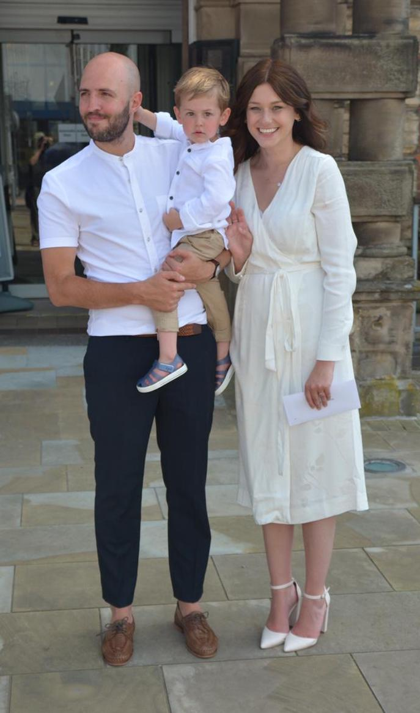

 

I live in Newcastle-under-Lyme, Staffordshire with my wife 
[Rachael](https://www.andyourbirdcansew.co.uk), our son Harrison and our 
daughter Amelie.

I grew up in nearby Burslem - the 'Mother Town' of the 
[Potteries](https://en.wikipedia.org/wiki/Staffordshire_Potteries). 

I'm a season ticket holder at [Port Vale FC](https://www.port-vale.co.uk/) and 
also support [Yorkshire CCC](https://yorkshireccc.com/) and 
[Minnesota Vikings](https://www.vikings.com/). 

Alongside an ever-growing record collection, 
[Radio 6 Music](https://www.bbc.co.uk/sounds/play/live:bbc_6music) forms the 
soundtrack to my life.

I'm a real bookworm and always have a book on the go. You can see what I've been 
reading recently [here](/reading/reading).

I work as Lead Sports Analyst at [bet365](https://www.bet365.com) where I design
and implement probabilistic models to drive the pricing of bets across a range 
of sports.

Feel free to contact me via [email](mailto:bobby@bobbyingram.co.uk). 